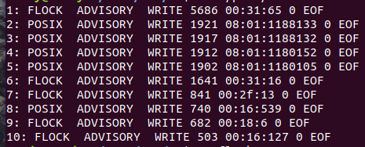

# Práctica 2.1.Introducción a la programación de Sistemas UNIX

[ej5](prueba/aas.c)

## Tabla de contenido
- [Creación y atributos de ficheros](#creación-y-atributos-de-ficheros).
- [Redirecciones y duplicación de descriptores](#redirecciones-y-duplicación-de-descriptores).
- [Cerrojos de ficheros](#cerrojos-de-ficheros).
- [Proyecto Comando ls extendido](#proyecto-Comando-ls-extendido).

## Creación y atributos de ficheros

*********************** **Ejercicio 1** ***********************

<pre>
<code>$man ls
</code></pre>

**-a:** Muestra todos los archivos (incluidos los ocultos, "." y "..").

**-l:** Muestra la lista con todos los detalles (Permisos, autores, bytes, fecha de creación de cada archivo).

**-d:** Muestra la lista de directorios (".").

**-h:** Muestra los tamaños del archivo en K, M, G (Es necesario: -l o -s).

**-i:** Muestra el inodo asociado a cada archivo.

**-R:** Muestra recursivamente todo lo que hay en los directorios.

**-1:** Muestra un archivo por línea.

**-F:** Clasifica la salida (con /=>@|).

**--color=auto=never:** Colorea (o no) la salida del ls según el tipo de archivo.

*********************** **Ejercicio 2** ***********************

<pre>
<code>$ls -ld
</code></pre>

drwxr-xr-x 3 mandy mandy 4096 ene 11 09:20 .

**Tipo:** Directorio.
**rmx_propietario:** lectura, escritura y ejecución.
**rmx_grupo:** ejecución y lectura.
**rmx_resto:** ejecución.

*********************** **Ejercicio 3** ***********************

<pre>
<code>$chmod 645 file
$chmod u+rw-x,g+r-wx,o+rx-w file
</code></pre>

*********************** **Ejercicio 4** ***********************

<pre>
<code>$mkdir test
$chmod -x test/
$cd test
</code></pre>

Resultado:
bash: cd: test/: Permiso denegado

*********************** **Ejercicio 5** ***********************

[ej5](Creación y atributos de ficheros/ej5.c)

*********************** **Ejercicio 6** ***********************

<pre>
<code>$umask 022 #Para dejar el valor por defecto.
</code></pre>

umask te devuelve el valor del octal en decimal.

[ej6](Creación y atributos de ficheros/ej6.c)

*********************** **Ejercicio 7** ***********************

[ej7](Creación y atributos de ficheros/ej7.c)

*********************** **Ejercicio 8** ***********************

<pre>
<code>$ls -i
&man stat
</code></pre>

*********************** **Ejercicio 9** ***********************

[ej9](Creación y atributos de ficheros/ej9.c)

**st_atime:** es el último acceso (cuando se hace open por ejemplo).

**st_mtime:** es la última modifciación dentro del archivo.

**st_ctime:** es la última modificación ya sea de permisos, del archivo, de nombre...

*********************** **Ejercicio 10** ***********************

**Enlace Duro:** Es un nuevo nombre para un fichero, apunta al mismo nodo i y no ocupan espacio en el disco.
**Enlace Simbólico:** El archivo con enlace simbólico contiene la ruta del archivo al que se le ha hecho el enlace.

a)

<pre>
<code>$touch archivo
&mkdir directorio
&ln -s archivo archivosim
&ln -s directorio directoriosim
$ls -li
</code></pre>

Podemos observar que los inodos para cada fichero son diferentes y que los enlaces simbólicos vienen representado con un "l" y además te dicen al fichero dónde apuntan.

b)

<pre>
<code>$touch 1archivo
&mkdir 1directorio
&ln 1archivo 1archivodur
&ln 1directorio 1directoriodur
$ls -li
</code></pre>

No se puede crear enlaces duros para directorios.

Podemos observar que ambos archivos tienen el mismo nodo i.

c)

<pre>
<code>$rm -rf 1archivo1dur #No pasa nada
rm -rf archivosim #No pasa nada
&ln 1archivo 1archivodur
&ln -s archivo archivosimtouch archu
&rm -rf archivo #Se corrompe el enlace simbólico.
</code></pre>

*********************** **Ejercicio 11** ***********************

[ej11](Creación y atributos de ficheros/ej11.c)

## Redirecciones y duplicación de descriptores

*********************** **Ejercicio 1** ***********************

[ej1](Redirecciones y duplicación de descriptores/ej1.c)

*********************** **Ejercicio 2** ***********************

[ej2](Redirecciones y duplicación de descriptores/ej2.c)

ls > dirlist 2>&1: Redirecciona la salida estándar a dirlist y luego la salida de errores la redirecciona a la 1 que corresponde a dirlist. Por lo tanto,, ambas salidas se van a ver en dirlist.
ls 2>&1 > dirlist: Redirecciona la salida de error a la salida estándar y la salida estándar a dirlist, por lo tanto los errores se van a ver por pantalla y la salina normal en el fichero dirlist.

*********************** **Ejercicio  3** ***********************

<pre>
<code>$int fcntl(int filedescriptor, F_DUPFD);
</code></pre>

## Cerrojos de ficheros

*********************** **Ejercicio 1** ***********************

<pre>
<code>$cat /porc/locks;
</code></pre>

**1.-** El identificador del bloqueo.

**2.-** Tipo de bloqueo (POSIX si el bloqueo se hizo con fcntl y FLOCK si se creó con flock.)

**3.-** Modo de bloqueo (ADVISORY o MANDATORY)

  -Advisory: El acceso a los datos está permitido y evita otros bloqueos.

  -Mandatory: El acceso a los datos está denegado mientras esté bloqueado.

**4.-** Tipo de bloqueo (WRITE o READ), correspondiente a bloqueos compartidos o exclusivos.

  -Write (Exclusivo): El proceso está escribiendo por lo que no se puede leer ni escribir en el área bloqueada.

  -Read (Compartido): El proceso está leyendo por lo que el área no puede ser modificada.

**5.-** PID del proceso que tiene el bloqueo sobre el fichero.

**6.-** Tres números separados por :, que identifican el fichero bloqueado.

**7.-** Byte donde comienza el bloqueo en el fichero.

**8.-** Byte donde acaba el bloqueo del fichero.

*********************** **Ejercicio 2** ***********************

[ej2](Cerrojos_de_ficheros/ej2.c)

*********************** **Ejercicio 3** ***********************

<pre>
<code>$man flock;
</code></pre>

Sirve para crear cerrojos en scripts de shell.

## Proyecto Comando ls extendido

[ls.c](Ls extendido/ls.c)
